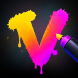

  

<h1 align="center">Vandal</h1>

  <strong>The screenshot tool that gets out of your way.</strong> 
  Free, open-source screen capture and markup for Windows.

  <!-- TODO(Phase 4): release and build badges once hosting is decided. -->
  <strong>Beta</strong> · Windows 10 (1903+) and Windows 11 · x64

---

Press a shortcut, drag over any part of the screen, mark it up right there, and it's on your
clipboard. Vandal freezes the screen the instant you press the shortcut, so open menus, tooltips
and hover states stay in the picture.

<!-- TODO(Phase 4): screenshot: selecting a region on a dimmed screen (docs/images/select.png) -->
<!-- TODO(Phase 4): screenshot: quick edit toolbar under a selection (docs/images/quick-edit.png) -->

> **Vandal is in beta.** It's being tested by a small group before a public release.
> Expect rough edges, and please [report anything odd](#feedback-and-bug-reports).

## Why Vandal?

If you take screenshots all day, small annoyances add up fast. Vandal has the markup tools you
already know (arrows, boxes, highlights, text) and is built so you spend less time on each
screenshot.

- **Less click, more markup.** Keys to pick tools, number keys set the line width or font size,
  Ctrl+number picks a color, Alt+number picks a font. Mark up without hunting through menus.
- **Only the options you use.** Choose exactly which colors, widths, fonts and font sizes appear
  in the pickers, for every tool or per tool. Load your brand or project styles once and skip
  scrolling through hundreds of fonts.
- **Use the controls you like.** A size can be a row of buttons, a dropdown, a stepped
  slider or a free slider with your own range.
- **It remembers.** Each tool keeps its own color, size, font, arrowheads and more, even after a
  restart. Set a style once and every screenshot after it matches.
- **Automate the routine.** Decide what happens after a capture: copy, save to a file, open in
  the editor, or any mix.
- **Free, private and light.** Open source, no account, no tracking, no network connections,
  and no admin rights needed.

### Who it's for

People who take and mark up screenshots many times a day: **developers, QA testers, technical
writers, support teams and account managers**. It's especially handy for guides and manuals,
where every screenshot should look the same.

### Driving principles

1. **Speed.** Common actions are one keystroke. The tool stays out of the way.
2. **Simplicity.** A clean interface with the features you'll use every day. No kitchen sink.
3. **Personalization.** Your values, your controls, your workflow, remembered.

## Contents

- [Install](#install)
- [Getting started](#getting-started)
- [Capturing](#capturing)
- [Quick edit](#quick-edit)
- [The editor](#the-editor)
- [Opening images](#opening-images)
- [Copying and saving](#copying-and-saving)
- [Settings](#settings)
- [Command line](#command-line)
- [Keyboard reference](#keyboard-reference)
- [Updating and uninstalling](#updating-and-uninstalling)
- [Troubleshooting](#troubleshooting)
- [Privacy](#privacy)
- [All features](#all-features)
- [Feedback and bug reports](#feedback-and-bug-reports)
- [Building from source](#building-from-source)
- [License](#license)

## Install

<!-- TODO(Phase 4): download link once hosting is decided. -->

1. Download the latest `Vandal_<version>_x64-setup.exe` (download link coming soon).
2. Run it. Vandal installs for your user account only, so no administrator rights are needed.
3. **Windows SmartScreen will probably warn you** ("Windows protected your PC"). Beta
   builds aren't code-signed yet, so Windows doesn't recognize them. Click
   **More info → Run anyway**.
4. Vandal starts in the tray (bottom-right, next to the clock; it may be under the **^**
   overflow arrow). You can drag its icon onto the taskbar to keep it visible.

Vandal needs Microsoft Edge WebView2, which is part of Windows 11 and up-to-date Windows 10.
If it's missing, the installer downloads it for you.

## Getting started

1. Press **Win+F12**.
2. Drag over the part of the screen you want.
3. Press **Enter** (or double-click inside the selection).

The image is now on your clipboard. Paste it anywhere with Ctrl+V. A notification confirms
the capture; click it to open the image in the editor.

To draw on it first, pick a tool from the toolbar under the selection before you press Enter
(see [Quick edit](#quick-edit)).

You can also left-click the tray icon to start a capture, or right-click it for the menu:

| Tray menu item        | What it does                                               |
| --------------------- | ---------------------------------------------------------- |
| Capture region        | Same as Win+F12                                            |
| Capture full screen   | Same as Win+Shift+F12: every monitor, opened in the editor |
| Open image…           | Open an image file in the editor                           |
| New from clipboard    | Open the image on the clipboard in the editor              |
| Save captures to file | Turn auto-save on or off                                   |
| Launch on login       | Start Vandal with Windows (on by default)                  |
| Settings…             | Open Settings                                              |
| Quit                  | Close Vandal                                               |

## Capturing

| Shortcut          | Capture                                |
| ----------------- | -------------------------------------- |
| **Win+F12**       | Select a region                        |
| **Win+Shift+F12** | All monitors, straight into the editor |

You can change both shortcuts in **Settings › Capture › Keyboard shortcuts**.

While you're selecting a region:

| Key / mouse              | Action                                                                        |
| ------------------------ | ----------------------------------------------------------------------------- |
| Drag                     | Draw a selection. Drag the handles to resize it, or drag inside it to move it |
| **Enter** / double-click | Finish                                                                        |
| **F**                    | Capture the whole monitor under the pointer (opens the editor)                |
| **A**                    | Capture all monitors (opens the editor)                                       |
| Arrow keys               | Move the selection by 1 pixel (Shift: 10 pixels)                              |
| Ctrl + arrow keys        | Resize from the bottom-right corner (Shift: 10 pixels)                        |
| **Esc** / right-click    | Cancel                                                                        |

F and A work only before you've drawn a selection. After that, A is the arrow tool.

## Quick edit

When you release the mouse, a toolbar appears under the selection (or above it if there's no
room). Pick a tool and draw straight onto the frozen screen.

<!-- TODO(Phase 4): screenshot: quick edit with an arrow and a text label (docs/images/quick-edit-markup.png) -->

- **Enter** or **Done** finishes: the result is copied (and saved, if auto-save is on).
- **Ctrl+C** copies and **Ctrl+S** saves, then quick edit closes.
- **Ctrl+E** or **Open in editor** moves your selection and marks into the full editor, still editable.
- **Esc** goes back one step at a time: stop typing, deselect, put the tool down, and finally
  close without saving.

Once you've drawn something, dragging outside the selection and right-clicking no longer cancel,
so a stray click can't lose your work. To turn quick edit off (Enter then just copies the region),
use **Settings › Capture**.

## The editor

The editor opens for full-screen captures, from **Open in editor**, when you click a capture
notification, and for image files.

<!-- TODO(Phase 4): screenshot: the editor window with markup (docs/images/editor.png) -->

- **Tools:** Select (V), Pen (P), Highlighter (H), Line (L), Arrow (A), Rectangle (R),
  Ellipse (E), Text (T) and Crop (C). The same tools, apart from Crop, are in quick edit.
- **Styles:** the options bar shows the current tool's color, width, fill, font, size, and so
  on. Changing a style while a mark is selected restyles that mark.
- **Editing marks:** click a mark to select it, drag to move it, and drag its handles to reshape
  it. Double-click text (or press Enter) to edit it.
- **Crop** never throws pixels away: undo it, or choose **Show full capture** in crop mode to
  get the rest back.
- **Zoom and pan:** Ctrl+mouse wheel, Ctrl+= / Ctrl+−, Ctrl+0 to fit, Ctrl+Shift+0 for actual
  size. Pan with Space+drag or the middle mouse button.
- **Closing** copies the image by default (you can change this in **Settings › Copy & save**).
  If nothing copies or saves it on close, Vandal asks before discarding changes.

## Opening images

Vandal can mark up existing images too:

- right-click an image in Explorer › **Open with** › **Vandal**. Vandal doesn't make itself the
  default app for anything.
- **Open image…** in the tray menu or the editor (Ctrl+O)
- drag files onto an editor window
- **New from clipboard** in the tray menu
- `vandal --edit <file>` (see [Command line](#command-line))

It opens PNG, JPEG, BMP, GIF (first frame), TIFF, ICO and WebP, plus HEIC and AVIF if Windows
has those codecs installed. Photos are turned the right way up automatically.

**Save (Ctrl+S) overwrites the original file**, with your markup flattened into it. Vandal
warns you the first time. Use **Save As** (Ctrl+Shift+S) to keep the original. Formats Vandal
can't write (WebP, HEIC, AVIF, GIF, ICO) always go to Save As, with PNG selected.

## Copying and saving

What happens after a capture is set in **Settings › Copy & save**:

- **Copy to clipboard:** on by default.
- **Save to a file automatically:** off by default. It can also be switched from the tray menu.
- **Open in the editor:** off by default.

Captures are saved as PNG in `Pictures\Screenshots`, named like
`Screenshot 2026-09-28 14-05-09.png`. You can change the folder and the name pattern. The
pattern understands `{yyyy}` `{MM}` `{dd}` for the date and `{HH}` `{mm}` `{ss}` for the time.
If a file already has that name, a number is added: `… (2).png`.

Capture notifications have buttons to **Edit**, **Save**, or **Open folder** (after saving).

## Settings

Open Settings from the tray menu, or with `vandal --settings`. Changes apply immediately, with
no restart. Use the search box to find a setting by name.

| Page        | What's there                                                                                                  |
| ----------- | ------------------------------------------------------------------------------------------------------------- |
| General     | Theme (light, dark or follow Windows), accent color, launch on login, notification buttons, tray menu options |
| Capture     | Capture shortcuts, screen dimming, selection size readout, quick edit behavior                                |
| Copy & save | What happens after a capture and when the editor closes, save folder, file-name pattern, overwrite warning    |
| Markup      | Color presets, line widths, fonts and font sizes (also per tool), how the pickers look, shortcut hints        |
| About       | Version                                                                                                       |

Settings are stored in `%APPDATA%\com.vandal.desktop\settings.json`. They're kept when you
update Vandal.

## Command line

`vandal.exe` is in `%LOCALAPPDATA%\Vandal\`. Only one copy of Vandal runs at a time. Running it
again passes the command to the copy that's already running.

| Command                | What it does                                                    |
| ---------------------- | --------------------------------------------------------------- |
| `vandal`               | Starts Vandal. If it's already running, starts a region capture |
| `vandal --settings`    | Opens Settings                                                  |
| `vandal --edit <file>` | Opens an image in the editor. Repeat `--edit` to open several   |

A second launch that starts a capture is handy for mapping a capture to a mouse button, a
Stream Deck key or a launcher.

## Keyboard reference

Keys are matched by position, so they work on any keyboard layout and on the number row or the
numpad.

**Tools** (editor and quick edit)

| Key | Tool               | Key | Tool      |
| --- | ------------------ | --- | --------- |
| V   | Select             | A   | Arrow     |
| P   | Pen                | R   | Rectangle |
| H   | Highlighter        | E   | Ellipse   |
| L   | Line               | T   | Text      |
| C   | Crop (editor only) |     |           |

**Styles**

| Keys              | Action                                                   |
| ----------------- | -------------------------------------------------------- |
| 1–9, 0            | Line width, or font size for text (0 is the 10th choice) |
| Ctrl+1–9, 0       | Color preset                                             |
| Ctrl+Shift+1–9, 0 | Fill color                                               |
| Alt+1–9, 0        | Font (text)                                              |
| Ctrl+B / Ctrl+I   | Bold / italic (text)                                     |

The number keys pick the choices in the order the pickers show them. Their shortcut numbers are
printed on the pickers (you can hide them in Settings).

**Editing**

| Keys                 | Action                                                         |
| -------------------- | -------------------------------------------------------------- |
| Ctrl+Z               | Undo                                                           |
| Ctrl+Y, Ctrl+Shift+Z | Redo                                                           |
| Ctrl+A               | Select all marks                                               |
| Ctrl+D               | Duplicate the selected marks                                   |
| Delete / Backspace   | Delete the selected marks                                      |
| Arrow keys           | Move the selected marks by 1 pixel (Shift: 10)                 |
| Ctrl+] / Ctrl+[      | Bring forward / send backward (with Shift: to front / to back) |
| Enter                | Edit the selected text                                         |
| Esc                  | Step back: deselect, then put the tool down                    |

**Editor window**

| Keys                  | Action                                                                   |
| --------------------- | ------------------------------------------------------------------------ |
| Ctrl+C                | Copy the image                                                           |
| Ctrl+S                | Save (captures use your file-name pattern; opened files are overwritten) |
| Ctrl+Shift+S          | Save As                                                                  |
| Ctrl+O                | Open an image                                                            |
| Ctrl+N                | New capture                                                              |
| Ctrl+W                | Close                                                                    |
| Ctrl+= / Ctrl+−       | Zoom in / out                                                            |
| Ctrl+0 / Ctrl+Shift+0 | Fit to window / actual size                                              |

**Quick edit**

| Keys                 | Action                                      |
| -------------------- | ------------------------------------------- |
| Enter / double-click | Done                                        |
| Ctrl+C / Ctrl+S      | Copy / save, then close                     |
| Ctrl+E               | Open in the editor                          |
| Esc                  | Step back, and finally close without saving |

## Updating and uninstalling

**Updating:** run the new installer over the old version. Your settings are kept. Automatic
updates are coming in a later beta.

**Uninstalling:** go to Windows **Settings › Apps › Installed apps**, find **Vandal** and choose
**Uninstall**. This also removes Vandal from Explorer's "Open with" list. Saved screenshots are
never touched.

## Troubleshooting

**A shortcut doesn't do anything.** Another app (or Windows) may already use that key
combination. Choose a different one in **Settings › Capture › Keyboard shortcuts**. Vandal
checks whether a new shortcut is free before saving it.

**I want to use the PrintScreen key.** Windows 11 gives PrintScreen to Snipping Tool by default.
Settings › Capture › Keyboard shortcuts has a button that opens the Windows setting to turn that
off, and then you can record PrintScreen as your shortcut.

**Parts of the capture are black.** Some apps and video players block screen capture for
copyright-protected content. Windows returns black pixels for those.

**I can't find the tray icon.** Click the **^** arrow next to the clock. To keep Vandal always
visible, drag its icon onto the taskbar, or turn it on in Windows **Settings › Personalization ›
Taskbar › Other system tray icons**.

**SmartScreen blocks the installer.** Click **More info → Run anyway** (see [Install](#install)).

## Privacy

Vandal works entirely on your PC. Captures stay in memory until you copy or save them.
Vandal doesn't collect usage data and doesn't make network connections.

<!-- TODO(Phase 4): once the updater exists, note that Vandal checks for updates (and what that sends),
     and add a link to a privacy policy. -->

## All features

**Capture**

- Freezes the screen the instant you press the shortcut: open menus, tooltips and hover states
  stay in the picture
- Region, one monitor or all monitors
- Pixel-exact on multi-monitor setups with mixed scaling
- Precise selection with handles, arrow keys and a size readout
- Your own capture shortcuts (Win+F12 and Win+Shift+F12 by default), checked for conflicts,
  including PrintScreen

**Markup**

- Pen, highlighter, line, arrow, rectangle, ellipse and text
- Quick edit: draw right on the frozen screen, without opening a window
- Full editor with zoom, pan, undo/redo and crop that never throws pixels away
- Every mark stays editable: select, move, resize, restyle, duplicate, reorder or delete it
- Single-key tools, plus number-key shortcuts for widths, font sizes, colors, fill and fonts
- Shortcuts work on any keyboard layout, on the number row or the numpad

**Make it yours**

- Your own color presets, line widths, fonts and font sizes, for every tool or per tool
- Pick how each picker looks: buttons, dropdown, stepped slider or free slider
- Each tool remembers its styles between sessions
- Light, dark or follow-Windows theme; accent color that follows Windows or one you pick
- Choose what happens after a capture and when the editor closes (copy, save, open in the editor)
- Auto-save folder and file-name pattern with date and time
- Searchable settings that apply immediately, with no restart

**Images and integration**

- Mark up existing images: PNG, JPEG, BMP, GIF, TIFF, ICO and WebP, plus HEIC and AVIF with
  the Windows codecs
- Explorer "Open with", drag and drop, or paste from the clipboard
- Command line for launchers, mouse buttons and Stream Deck keys
- Capture notifications with Edit, Save and Open folder buttons

**Light and private**

- Runs from the system tray and starts with Windows
- Installs for your user account only, with no admin rights
- Works entirely on your PC: no account, no usage data, no network connections
- Free and open source (GPL-3.0)
- A Rust core and an installer of about 2 MB. Vandal uses the WebView2 already in Windows
  instead of bundling a browser engine

## Feedback and bug reports

<!-- TODO(Phase 4): feedback address or issue tracker, once hosting is decided. -->

Found a bug or have an idea? Please tell us. It helps to include:

- your Vandal version (**Settings › About**) and Windows version
- how many monitors you use and their scaling (Windows **Settings › System › Display**)
- what you did, what you expected, and what happened instead, with a screenshot if you can

## Building from source

Vandal is open source. To build it yourself or to contribute, see
[DEVELOPMENT.md](DEVELOPMENT.md).

## License

Copyright © 2026 Richard Podsada.

Vandal is free software: you can redistribute it and/or modify it under the terms of the
[GNU General Public License](LICENSE) as published by the Free Software Foundation,
either version 3 of the License, or (at your option) any later version.

Vandal is distributed in the hope that it will be useful, but WITHOUT ANY WARRANTY, without even
the implied warranty of MERCHANTABILITY or FITNESS FOR A PARTICULAR PURPOSE. See the GNU General
Public License for more details.
