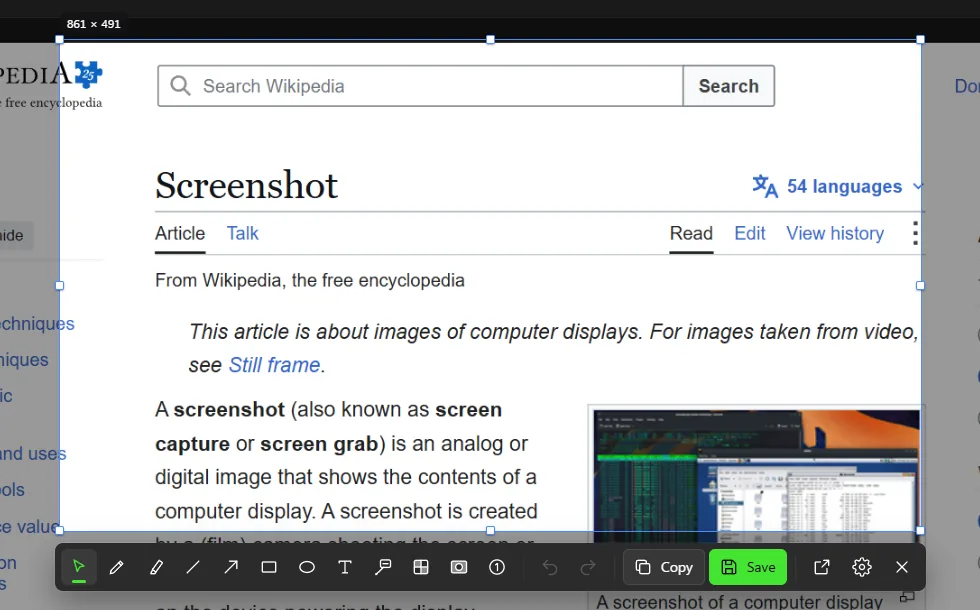
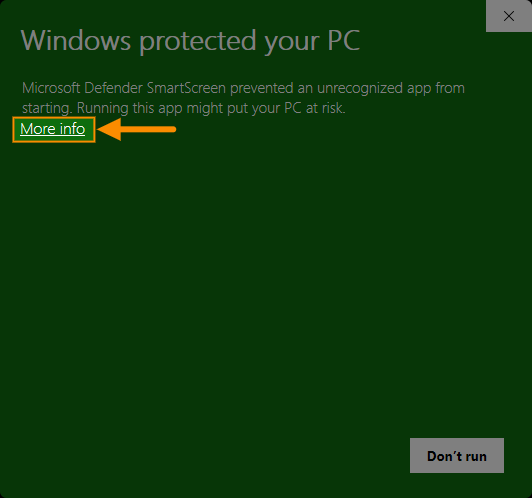
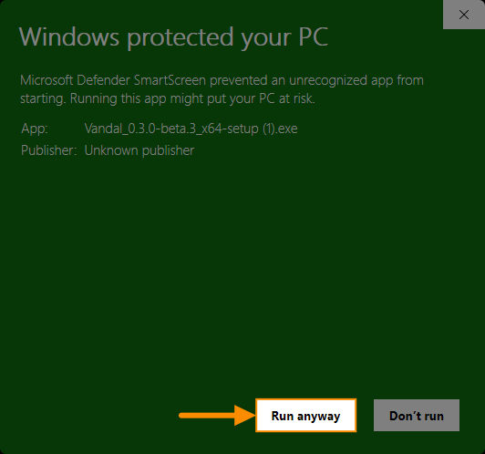

<p align="center">
  
</p>

<h1 align="center">Vandal</h1>

<p align="center">
  <strong>The screenshot tool that gets out of your way.</strong><br>
  Free, open-source screen capture and markup for Windows.
</p>

<p align="center">
  <!-- TODO(Phase 4): release and build badges once hosting is decided. -->
  <strong>Beta</strong> · Windows 10 (1903+) and Windows 11 · x64
</p>

<p align="center">
  <a href="https://github.com/rpodsada/vandal/releases"></a>
</p>

<p align="center">
  <a href="https://vandalscreenshot.com"><strong>vandalscreenshot.com</strong></a>
</p>

---

<p align="center">
  
</p>

Press a shortcut, drag over any part of the screen, mark it up right there, and it's on your
clipboard. Vandal freezes the screen the instant you press the shortcut, so open menus, tooltips
and hover states stay in the picture.

<!-- TODO(Phase 4): screenshot: selecting a region on a dimmed screen (docs/images/select.png) -->

> **Vandal is in beta.** Expect rough edges, and please [report anything odd](#feedback-and-bug-reports).

## Why Vandal?

If you take screenshots all day, small annoyances add up fast. Vandal has the markup tools you
already know (arrows, boxes, highlights, text) and is built so you spend less time on each
screenshot.

- **Less click, more markup.** Keys to pick tools, number keys set the line width or font size,
  Ctrl+number picks a color, Alt+number picks a font. Mark up without hunting through menus.
- **Simplicity.** Only the most useful markup tools, designed and built well with a nice UI,
  and no extra fluff. Vandal isn't meant to be a kitchen sink.
- **Personalize to your workflow.** Choose exactly which colors, widths, fonts and font sizes appear
  in the pickers, for every tool or per tool. Load your brand or project styles once and skip
  scrolling through hundreds of fonts.
- **Use the controls you like.** A size picker can be a row of buttons, a dropdown, a stepped
  slider or a free slider with your own values. Make the UI fit your workflow and needs, not the
  other way around.
- **It remembers.** Each tool remembers its own settings (color, size, font, options, everything),
  even after a restart. Set your style once, and every screenshot after will match.
- **Free, fast, private, and lightweight.** Open source, no account, no tracking, and no admin
  rights needed. The only connection Vandal makes is an update check, which you can turn off.
  Built in Rust with an installer of about 3.5 MB.

### Who it's for

People who take and mark up screenshots many times a day: **developers, QA testers, technical
writers, support teams and account managers**. It's especially handy for guides and manuals,
where every screenshot should look the same.

> If you suffer from the Windows Snipping Tool, like I did, this will change your life.

### Driving principles

1. **Speed.** Common actions are one keystroke. The tool stays out of the way.
2. **Simplicity.** A clean interface with the features you'll use every day. No kitchen sink.
3. **Personalization.** Your values, your controls, your workflow, remembered.

## Contents

- [Install](#install)
- [Getting started](#getting-started)
- [Capturing](#capturing)
- [Quick edit](#quick-edit)
- [The editor](#the-editor)
- [Opening images](#opening-images)
- [Copying and saving](#copying-and-saving)
- [Browser extension](#browser-extension)
- [Settings](#settings)
- [Command line](#command-line)
- [Keyboard reference](#keyboard-reference)
- [Updating and uninstalling](#updating-and-uninstalling)
- [Verify your download](#verify-your-download)
- [Troubleshooting](#troubleshooting)
- [Privacy](#privacy)
- [All features](#all-features)
- [Feedback and bug reports](#feedback-and-bug-reports)
- [Building from source](#building-from-source)
- [License](#license)

## Install

<!-- TODO(Phase 4): download link once hosting is decided. -->

1. Download the latest `Vandal_<version>_x64-setup.exe` (download link coming soon).
2. Run it. Vandal installs for your user account only, so no administrator rights are needed.
3. **Windows SmartScreen will warn you** ("Windows protected your PC"). Beta builds
   aren't code-signed yet, so Windows doesn't recognize them. Click **More info**, then
   **Run anyway**:

   
   

4. Vandal starts in the tray (bottom-right, next to the clock; it may be under the **^**
   overflow arrow). You can drag its icon onto the taskbar to keep it visible.
5. **Vandal starts with Windows from now on**, so your capture shortcut always works. To
   turn that off, untick **Launch on login** in the tray menu (or in **Settings › General**).

Vandal needs Microsoft Edge WebView2, which is part of Windows 11 and up-to-date Windows 10.
If it's missing, the installer downloads it for you.

To check that the installer is genuine before you run it, see
[Verify your download](#verify-your-download).

## Getting started

1. Press **Win+F12** (you can change it in **Settings › Keyboard shortcuts**).
2. Drag over the part of the screen you want. A toolbar appears under the selection: this is
   [quick edit](#quick-edit). Pick a tool and mark up the screenshot right there, or skip it.
3. Press **Enter** (or double-click inside the selection).

The image is now on your clipboard. Paste it anywhere with Ctrl+V. A notification confirms
the capture; click it (or its **Edit** button) to keep working on it in the editor, with your
marks still editable. Nothing is saved to a file unless you press **Save** (Ctrl+S) or turn on
auto-save.

You can also left-click the tray icon to start a capture, or right-click it for the menu:

| Tray menu item      | What it does                                                               |
| ------------------- | -------------------------------------------------------------------------- |
| Capture region      | Same as Win+F12                                                            |
| Capture window      | Same as Win+Alt+F12                                                        |
| Capture full screen | A whole screen, opened in the editor. With several, pick one from its list |
| Capture all screens | Every screen as one image (shown with more than one screen)                |
| New editor window   | An empty editor: open, paste or capture an image into it                   |
| New from clipboard  | Open the image on the clipboard in the editor                              |
| Open image…         | Open an image file in the editor                                           |
| Launch on login     | Start Vandal with Windows (on by default)                                  |
| Settings…           | Open Settings                                                              |
| Restart to update   | Install a new version (shown once one is ready)                            |
| Quit                | Close Vandal                                                               |

Clicking the tray icon, and opening Vandal from its desktop or Start menu icon, can open an
empty editor instead of starting a capture: **Settings › General › Tray icon and app icon**.

## Capturing

| Shortcut          | Capture                                                |
| ----------------- | ------------------------------------------------------ |
| **Win+F12**       | Select a region                                        |
| **Win+Alt+F12**   | Click a window                                         |
| **Win+Shift+F12** | The screen the pointer is on, straight into the editor |

You can change these in **Settings › Keyboard shortcuts**, and give **Capture all screens** a
shortcut there too (it has none at first).

While you're selecting a region:

| Key / mouse              | Action                                                                        |
| ------------------------ | ----------------------------------------------------------------------------- |
| Drag                     | Draw a selection. Drag the handles to resize it, or drag inside it to move it |
| **Enter** / double-click | Finish                                                                        |
| **F**                    | Capture the whole monitor under the pointer (opens the editor)                |
| **W**                    | Click a window to capture it                                                  |
| **A**                    | Capture all monitors (opens the editor). Not shown with one monitor           |
| Arrow keys               | Move the selection by 1 pixel (Shift: 10 pixels)                              |
| Ctrl + arrow keys        | Resize from the bottom-right corner (Shift: 10 pixels)                        |
| Shift while dragging     | Draw a square, keep the proportions from a corner, or move in a straight line |
| **Esc** / right-click    | Cancel                                                                        |

With quick edit, F, W and A work only before you've drawn a selection. After that, A is the arrow
tool. While picking a window, **W** or **Esc** goes back to selecting a region.

## Quick edit

When you release the mouse, a toolbar appears under the selection (or above it if there's no
room). Pick a tool and draw straight onto the frozen screen. Every markup tool is there; only
Crop is the editor's.

<!-- TODO(Phase 4): screenshot: quick edit with an arrow and a text label (docs/images/quick-edit-markup.png) -->

- **Enter** (or double-click inside the selection) finishes: the result is copied (and saved, if
  auto-save is on).
- **Ctrl+C** or **Copy** copies and **Ctrl+S** or **Save** saves, then quick edit closes. To keep
  it open after either, use **Settings › Capture**.
- **Ctrl+E** or **Open in editor** moves your selection and marks into the full editor, still editable.
- **Ctrl+,** or the gear opens Settings on top of quick edit, so you see changes as you make them.
- **Esc** goes back one step at a time: stop typing, deselect, put the tool down, and finally
  close without saving. The **×** button closes straight away.

Once you've drawn something, dragging outside the selection and right-clicking no longer cancel,
so a stray click can't lose your work. To turn quick edit off (Enter then just copies the region),
use **Settings › Capture**. With quick edit off, the full-screen shortcut and **F** / **A** copy
the capture instead of opening the editor.

## The editor

The editor opens for full-screen captures, from **Open in editor**, when you click a capture
notification, and for image files. **New editor window** in the tray menu opens an empty one:
open, drop, paste (Ctrl+V) or capture an image into it.

<!-- TODO(Phase 4): screenshot: the editor window with markup (docs/images/editor.png) -->

- **Tools:** Select (V), Pen (P), Highlighter (H), Line (L), Arrow (A), Rectangle (R),
  Ellipse (E), Text (T), Callout (O), Redact (B), Spotlight (S), Step marker (N) and Crop (C).
  The same tools, apart from Crop, are in quick edit. You can change their keys in
  **Settings › Keyboard shortcuts**.
  - **Callout:** a text box with a pointer. Drag from what to point at to where the text goes.
    The box can be filled, outlined or an underline, and the pointer can end in an arrow or a dot.
  - **Redact:** black out, pixelate or blur an area. The pixels in the copied or saved image
    are really changed. Use **Solid** (the default) for text such as passwords: pixelated or
    blurred text can sometimes be read back with special tools.
  - **Detect text** (in Redact's options): Vandal finds the words in the image and outlines
    them. Click a word to redact it, triple-click for its whole line, or drag across text, as
    you would select it in a document. Each line becomes its own redaction, in the mode you've
    picked. Click a redaction to remove it again; Ctrl+click selects it to move or resize it.
    Words Vandal didn't find have no outline: drag from empty space to cover them with a box.
    It uses the text recognition built into Windows, which needs a Windows language with text
    recognition (most come with it).
  - **Spotlight:** darken everything outside a rectangle or ellipse.
  - **Step marker:** click to place numbered (or lettered) markers that count up and renumber
    themselves.
  - **Lines and arrows** bend: drag the diamond handle on a selected one. Rectangles can have
    rounded corners.
- **Styles:** the options bar shows the current tool's colors, width, fill, font, size, and so
  on. Changing a style while a mark is selected restyles that mark. Where there are two colors
  (fill and border, text and its box), **X** swaps them.
- **Editing marks:** click a mark to select it, drag to move it, and drag its handles to reshape
  it. Double-click text (or press Enter) to edit it. Right-click a mark for Duplicate, the
  stacking order (to front, forward one, back one, to back) and Delete.
- **Copying marks:** Ctrl+Shift+C copies the selected marks and Ctrl+V pastes them, into the
  same editor or another one, in front and selected (Ctrl+C copies the image). They keep their
  place relative to the image's top-left corner, and slide in if they'd land outside it. The
  right-click menu also has **Copy All Markup**, on a mark or on empty canvas.
- **Crop:** drag to draw the box (Ctrl+drag draws a new one anywhere), type an exact width and
  height, or keep a ratio such as 16:9 (with **Portrait** for 9:16). Enter applies, Esc cancels.
  Crop never throws pixels away: undo it, or choose **Show full capture** in crop mode to get
  the rest back.
- **Zoom and pan:** Ctrl+mouse wheel, Ctrl+= / Ctrl+−, Ctrl+0 to fit (again for Fit width, on a tall image), Ctrl+Shift+0 for actual
  size. Pan with the mouse wheel (Shift+wheel goes sideways), Space+drag or the middle mouse
  button.
- **Capture** (Ctrl+N) takes a new screenshot without quick edit and brings it back to the
  editor: into the same window if it's empty, otherwise a new one.
- **Closing** copies the image by default (you can change this in **Settings › Copy & save**).
  If nothing copies or saves it on close, Vandal asks before discarding changes.

## Opening images

Vandal can mark up existing images too:

- right-click an image in Explorer › **Open with** › **Vandal**. Vandal doesn't make itself the
  default app for anything.
- **Open image…** in the tray menu or the editor (Ctrl+O)
- drag files onto an editor window
- **New from clipboard** in the tray menu, or Ctrl+V in an empty editor
- `vandal --edit <file>` (see [Command line](#command-line))

It opens PNG, JPEG, BMP, GIF (first frame), TIFF, ICO and WebP, plus HEIC and AVIF if Windows
has those codecs installed. Photos are turned the right way up automatically.

**Flip through a folder** like in Windows Photos: with an image file open and nothing selected,
**←** and **→** open the previous and next image in its folder, going round from the last back to
the first, and **Home** and **End** open the first and last. The status bar shows where you are
("12 of 41"). Images are in Explorer's name order, and any that won't open are skipped. If you've
changed the image, Vandal asks whether to save it first.

**Save (Ctrl+S) overwrites the original file**, with your markup flattened into it. Vandal
warns you the first time. Use **Save As** (Ctrl+Shift+S) to keep the original. Formats Vandal
can't write (WebP, HEIC, AVIF, GIF, ICO) always go to Save As, with PNG selected.

## Copying and saving

What happens after a capture is set in **Settings › Copy & save**:

- **Copy to clipboard:** on by default.
- **Save to a file automatically:** off by default.
- **Open in the editor:** off by default.

Captures are saved as PNG in `Pictures\Screenshots`, named like
`Screenshot 2026-09-28 14-05-09.png`. You can change the folder and the name pattern. The
pattern understands `{yyyy}` `{MM}` `{dd}` for the date and `{HH}` `{mm}` `{ss}` for the time.
If a file already has that name, a number is added: `… (2).png`.

Capture notifications have buttons to **Edit**, **Save**, or **Open folder** (after saving).

## Browser extension

**Vandal Screen Capture** captures web pages from inside the browser: the visible area, a
region, or the whole page from top to bottom. Copy or save the capture right there, or
open it in Vandal's editor to mark it up.

Install it from the [Chrome Web Store](https://chromewebstore.google.com/detail/vandal-screen-capture/glniniimcccgnpgfddfdepdnpbajpnfc).

Click the V icon for the popup, or use a shortcut:

| Capture      | Shortcut    | What it does                                                         |
| ------------ | ----------- | -------------------------------------------------------------------- |
| (popup)      | Alt+Shift+V | Opens the popup                                                      |
| Visible area | Alt+Shift+S | What you see in the tab                                              |
| Region       | Alt+Shift+D | Drag an area on a frozen copy of the page, like Vandal's own overlay |
| Full page    | Alt+Shift+F | Scrolls through the page and stitches it together. Esc stops         |

Change the shortcuts at `chrome://extensions/shortcuts`. If one says "Not set", the browser or
another extension already uses that key.

**After capture**, set in the popup or the extension's Options: show the result tab (with Copy,
Save, Save as and Open in Vandal), copy, save, or open in Vandal. Saves go to the browser's
download folder, named by the extension's own pattern: Vandal's date and time codes plus
`{title}` and `{domain}` for the page, and `{n}` for a number that counts up.

**Full page** shows sticky headers once at the top and bottom bars, such as cookie banners,
once at the bottom. Pages taller than 65,000 px stop there. Pages that scroll inside a panel
instead of the page itself, such as web mail, get the visible area.

**Open in Vandal** sends the capture to Vandal's editor, starting Vandal if it isn't running.
Vandal's installer sets this up for Chrome, Edge, Brave and Chromium. If you install Vandal
while the browser is open, restart the browser once.

## Settings

Open Settings from the tray menu, with Ctrl+, in quick edit or the editor, or with
`vandal --settings`. Changes apply immediately, with no restart. Use the search box to find a
setting by name.

| Page               | What's there                                                                                                                                                                                                                                            |
| ------------------ | ------------------------------------------------------------------------------------------------------------------------------------------------------------------------------------------------------------------------------------------------------- |
| General            | Theme (light, dark or follow Windows), accent color, launch on login, what the tray icon and opening Vandal do, notifications and their buttons                                                                                                         |
| Capture            | Screen dimming, selection size readout, quick edit behavior                                                                                                                                                                                             |
| Copy & save        | What happens after a capture and when the editor closes, save folder, file-name pattern, overwrite warning                                                                                                                                              |
| Markup             | How tools behave (selecting under the pointer, one shared color, remembering styles), colors, line widths, fonts and font sizes, redact strengths, spotlight darkness, step markers, corner radii (also per tool), how the pickers look, shortcut hints |
| Keyboard shortcuts | The capture shortcuts, each tool's key and swap colors, and a list of the shortcuts that can't be changed                                                                                                                                               |
| Updates            | Check now, install an update, automatic checks on or off, and the update channel (Beta or Stable)                                                                                                                                                       |
| About              | Version, license, links to the website and the project, and a link to report a bug or suggest an idea                                                                                                                                                   |

Settings are stored in `%APPDATA%\com.vandal.desktop\settings.json`. They're kept when you
update Vandal.

## Command line

`vandal.exe` is in `%LOCALAPPDATA%\Vandal\`. Only one copy of Vandal runs at a time. Running it
again passes the command to the copy that's already running.

| Command                | What it does                                                     |
| ---------------------- | ---------------------------------------------------------------- |
| `vandal`               | Starts Vandal. If it's already running, starts a region capture¹ |
| `vandal --settings`    | Opens Settings                                                   |
| `vandal --edit <file>` | Opens an image in the editor. Repeat `--edit` to open several    |

A second launch that starts a capture is handy for mapping a capture to a mouse button, a
Stream Deck key or a launcher.

¹ Or opens the editor, if Settings › General › Tray icon and app icon › Opening Vandal says so.
Then a first launch opens the editor too.

## Keyboard reference

Keys are matched by position, so they work on any keyboard layout and on the number row or the
numpad.

**Tools** (editor and quick edit). These are the defaults: change them, or add Ctrl, Alt or
Shift, in **Settings › Keyboard shortcuts**, which also lists every shortcut.

| Key | Tool        | Key | Tool               |
| --- | ----------- | --- | ------------------ |
| V   | Select      | E   | Ellipse            |
| P   | Pen         | T   | Text               |
| H   | Highlighter | O   | Callout            |
| L   | Line        | B   | Redact             |
| A   | Arrow       | S   | Spotlight          |
| R   | Rectangle   | N   | Step marker        |
| X   | Swap colors | C   | Crop (editor only) |

**Styles**

| Keys                   | Action                                                                                 |
| ---------------------- | -------------------------------------------------------------------------------------- |
| 1–9, 0                 | Line width, text size, redact strength, darkness or marker size (0 is the 10th choice) |
| Shift+1–9, 0           | A callout's pointer thickness                                                          |
| Ctrl+1–9               | Color (with two colors: the fill, text or label); the 10th is click-only               |
| Ctrl+Shift+1–9         | The second color (the border, text box, marker or callout)                             |
| Alt+1–9, 0             | Font (text, callouts, step markers), or corner radius (rectangles, spotlight)          |
| Alt+↑ / Alt+↓          | Previous / next font, also while you type                                              |
| \` / Shift+\` / Alt+\` | The lowest of the above: the key left of 1 bottoms out a picker or slider              |
| Ctrl+B / Ctrl+I        | Bold / italic (text)                                                                   |

The number keys pick the choices in the order the pickers show them. Their shortcut numbers are
printed on the pickers (you can hide them in Settings).

**Editing**

| Keys                 | Action                                                         |
| -------------------- | -------------------------------------------------------------- |
| Ctrl+Z               | Undo                                                           |
| Ctrl+Y, Ctrl+Shift+Z | Redo                                                           |
| Ctrl+A               | Select all marks                                               |
| Ctrl+D               | Duplicate the selected marks                                   |
| Ctrl+Shift+C         | Copy the selected marks (editor)                               |
| Ctrl+V               | Paste copied marks (editor)                                    |
| Delete / Backspace   | Delete the selected marks                                      |
| Arrow keys           | Move the selected marks by 1 pixel (Shift: 10)                 |
| Ctrl+] / Ctrl+[      | Bring forward / send backward (with Shift: to front / to back) |
| Enter                | Edit the selected text, callout or step marker's label         |
| Esc                  | Step back: deselect, then put the tool down                    |
| Shift while drawing  | Square, circle, or lines at 45° steps                          |
| Shift while moving   | Move only horizontally or vertically                           |
| Ctrl+drag            | Draw over a mark instead of selecting it (or the reverse)      |

**Editor window**

| Keys                  | Action                                                                   |
| --------------------- | ------------------------------------------------------------------------ |
| Ctrl+C                | Copy the image                                                           |
| Ctrl+S                | Save (captures use your file-name pattern; opened files are overwritten) |
| Ctrl+Shift+S          | Save As                                                                  |
| Ctrl+O                | Open an image                                                            |
| ← / →                 | Previous / next image in the folder (an image file, nothing selected)    |
| Home / End            | First / last image in the folder                                         |
| Ctrl+N                | Capture, back into the editor                                            |
| Ctrl+V                | Paste an image into an empty editor (or copied marks, see Editing)       |
| Ctrl+Alt+Shift+C      | Copy all the markup as text (JSON), e.g. for a bug report                |
| Ctrl+Alt+Shift+V      | Replace the markup with the clipboard's, crop included on the same size  |
| Ctrl+W                | Close                                                                    |
| Ctrl+,                | Settings                                                                 |
| Ctrl+= / Ctrl+−       | Zoom in / out                                                            |
| Ctrl+0 / Ctrl+Shift+0 | Fit to window (again: Fit width) / actual size                           |
| Enter / Esc           | While cropping: apply / cancel                                           |
| Ctrl+drag             | While cropping: draw a new box anywhere                                  |

**Quick edit**

| Keys                 | Action                                      |
| -------------------- | ------------------------------------------- |
| Enter / double-click | Finish (copy, and save if auto-save is on)  |
| Ctrl+C / Ctrl+S      | Copy / save, then close                     |
| Ctrl+E               | Open in the editor                          |
| Ctrl+,               | Settings                                    |
| Esc                  | Step back, and finally close without saving |

## Updating and uninstalling

**Updating:** Vandal checks for updates when it starts and once a day. When there's a new
version, it tells you, and you choose when to install it: **Install** in the notification,
**Restart to update** in the tray menu, or **Install and restart** in **Settings › Updates**.
Vandal downloads the new version, checks that it was signed by Vandal's developer, and restarts
into it. Your settings are kept. Editors with unsaved changes ask you to save first, and
nothing installs while you're capturing.

- **Check now** in Settings › Updates checks right away.
- **Check for updates automatically** can be turned off. Vandal then never checks unless you
  press Check now.
- **Update channel:** Beta gets test versions before each release (the default if you
  installed a beta). Stable gets final releases only.
- You can always update by hand: run a newer installer over the old version.

Versions before 0.3.0-beta.7 can't update themselves: install beta.7 or later by hand once.

**Uninstalling:** go to Windows **Settings › Apps › Installed apps**, find **Vandal** and choose
**Uninstall**. This also removes Vandal from Explorer's "Open with" list. Saved screenshots are
never touched.

## Verify your download

Optional, but worth it while the installer isn't code-signed. Either check works:

- **Compare the SHA-256 with the website's.** The download dialog on
  [vandalscreenshot.com](https://vandalscreenshot.com) shows the installer's SHA-256 under
  **Check the download**. The website is hosted apart from GitHub, so a tampered installer
  can't come with a matching hash. In PowerShell:

  ```powershell
  Get-FileHash .\Vandal_<version>_x64-setup.exe
  ```

- **Check its build provenance** with the [GitHub CLI](https://cli.github.com). Every
  installer is built by this repository's release workflow, which signs a record of what it
  built. This proves the file came from that workflow, unchanged:

  ```powershell
  gh attestation verify .\Vandal_<version>_x64-setup.exe --repo rpodsada/vandal
  ```

## Troubleshooting

**A shortcut doesn't do anything.** Another app (or Windows) may already use that key
combination. Choose a different one in **Settings › Keyboard shortcuts**. Vandal
checks whether a new shortcut is free before saving it.

**A tool's key doesn't work.** Check its key in **Settings › Keyboard shortcuts**: you may have
changed or cleared it, or given it to another tool.

**I want to use the PrintScreen key.** Windows 11 gives PrintScreen to Snipping Tool by default.
Settings › Keyboard shortcuts has a button that opens the Windows setting to turn that
off, and then you can record PrintScreen as your shortcut.

**Parts of the capture are black.** Some apps and video players block screen capture for
copyright-protected content. Windows returns black pixels for those.

**I can't find the tray icon.** Click the **^** arrow next to the clock. To keep Vandal always
visible, drag its icon onto the taskbar, or turn it on in Windows **Settings › Personalization ›
Taskbar › Other system tray icons**.

**SmartScreen blocks the installer.** Click **More info → Run anyway** (see [Install](#install)).

**Something else?** [Open an issue on GitHub](https://github.com/rpodsada/vandal/issues/new)
(see [Feedback and bug reports](#feedback-and-bug-reports)).

## Privacy

Vandal works entirely on your PC. Captures stay in memory until you copy or save them.
Vandal doesn't collect usage data. Its only network connection is the update check. The full
policy is at [vandalscreenshot.com/privacy](https://vandalscreenshot.com/privacy/).

- **Update checks.** When Vandal starts and once a day, or when you press Check now, it
  downloads a small file from GitHub (`raw.githubusercontent.com`) that names the latest
  version. The request carries nothing about you: no ID and no usage data, only what any
  download sends (your IP address, and the updater's name and version as its user agent).
  An update you install is downloaded from GitHub Releases. Turn automatic checks off in
  **Settings › Updates**.

- **Notification thumbnail.** Windows only shows a notification's picture from a file, so for
  a capture you haven't saved, Vandal writes a small copy to `%TEMP%\vandal\last-capture.png`.
  Each capture replaces it, and Vandal deletes it when it quits (or next time it starts, if it
  didn't quit normally).
- **Detect text** reads the image with the text recognition built into Windows, on your PC.
  Nothing is sent anywhere, and the words it finds are forgotten with the image.
- **Settings** are kept in `%APPDATA%\com.vandal.desktop\settings.json`.
- **WebView2**, the part of Windows that draws Vandal's windows, follows Windows' own
  diagnostic data and SmartScreen settings, as it does for every app that uses it.
- **The browser extension** only reads a tab when you capture it (Chrome's `activeTab`), keeps
  its captures in the browser's own storage for a day, and sends nothing anywhere. Open in
  Vandal hands the image to Vandal on your PC.
- **Launch on login** adds Vandal to your user account's startup list (it's on by default; see
  [Install](#install)).

## All features

**Capture**

- Freezes the screen the instant you press the shortcut: open menus, tooltips and hover states
  stay in the picture
- Region, window, one monitor or all monitors
- Pixel-exact on multi-monitor setups with mixed scaling
- Precise selection with handles, arrow keys and a size readout
- Your own capture shortcuts (Win+F12, Win+Alt+F12 and Win+Shift+F12 by default), checked for
  conflicts, including PrintScreen

**Markup**

- Pen, highlighter, line, arrow, rectangle, ellipse and text
- Callouts (a text box with a pointer), redaction (solid, pixelate or blur), spotlight and numbered
  step markers
- Detect text: select words in the image to redact them, as in a document
- Curved lines and arrows, rounded corners, and two colors with a one-key swap
- Quick edit: draw right on the frozen screen, without opening a window
- Full editor with zoom, pan, undo/redo and crop that never throws pixels away
- Every mark stays editable: select, move, resize, restyle, duplicate, reorder or delete it,
  from the keyboard or a right-click menu
- Copy and paste marks between images
- Single-key tools (keys you can change), plus number-key shortcuts for sizes, colors, fonts and
  corners
- Shortcuts work on any keyboard layout, on the number row or the numpad

**Make it yours**

- Your own color presets, line widths, fonts and font sizes, for every tool or per tool
- Pick how each picker looks: buttons, dropdown, stepped slider or free slider
- Each tool remembers its styles between sessions
- Light, dark or follow-Windows theme; accent color that follows Windows or one you pick
- Choose what happens after a capture and when the editor closes (copy, save, open in the editor),
  and whether the tray icon and app icon capture or open the editor
- Auto-save folder and file-name pattern with date and time
- Searchable settings that apply immediately, with no restart

**Images and integration**

- Mark up existing images: PNG, JPEG, BMP, GIF, TIFF, ICO and WebP, plus HEIC and AVIF with
  the Windows codecs
- Explorer "Open with", drag and drop, or paste from the clipboard
- Flip through an image's folder with the arrow keys
- Command line for launchers, mouse buttons and Stream Deck keys
- Capture notifications with Edit, Save and Open folder buttons
- Browser extension for Chrome: visible area, region or full page, then copy,
  save or open in Vandal

**Light and private**

- Runs from the system tray and starts with Windows
- Installs for your user account only, with no admin rights
- Works entirely on your PC: no account and no usage data. The only connection is an update
  check, which you can turn off
- Updates itself when you say so, with every update signed and checked before it installs
- Free and open source (GPL-3.0)
- A Rust core and an installer of about 3.5 MB. Vandal uses the WebView2 already in Windows
  instead of bundling a browser engine

## Feedback and bug reports

Found a bug or have an idea? [Open an issue on GitHub](https://github.com/rpodsada/vandal/issues/new)
(it needs a free GitHub account), or look through the
[existing issues](https://github.com/rpodsada/vandal/issues) first in case it's already there.
You can also get there from **Settings › About › Report a bug or suggest an idea**. For a bug, it
helps to include:

- your Vandal version (**Settings › About**) and Windows version
- how many monitors you use and their scaling (Windows **Settings › System › Display**)
- what you did, what you expected, and what happened instead, with a screenshot if you can
- for a problem with markup, the markup itself: press **Ctrl+Alt+Shift+C** in the editor and
  paste the text into the issue

Security problems are the exception: please report those privately, as
[SECURITY.md](https://github.com/rpodsada/vandal/blob/main/SECURITY.md) explains.

## Building from source

Vandal is open source. To build it yourself or to contribute, see
[DEVELOPMENT.md](DEVELOPMENT.md).

## License

Copyright © 2026 Richard Podsada.

Vandal is free software: you can redistribute it and/or modify it under the terms of the
[GNU General Public License](LICENSE) as published by the Free Software Foundation,
either version 3 of the License, or (at your option) any later version.

Vandal is distributed in the hope that it will be useful, but WITHOUT ANY WARRANTY, without even
the implied warranty of MERCHANTABILITY or FITNESS FOR A PARTICULAR PURPOSE. See the GNU General
Public License for more details.
